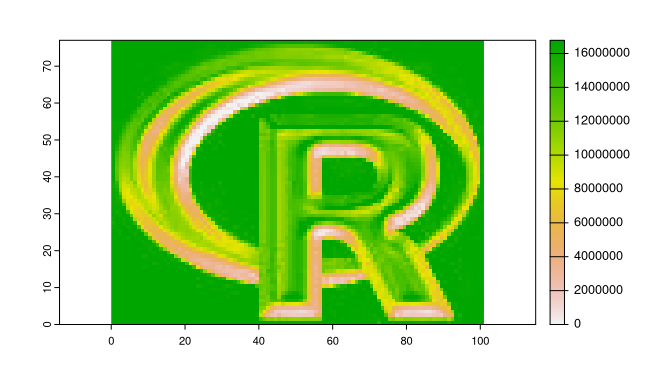

<!-- README.md is generated from README.Rmd. Please edit that file -->

# reedsolomon

<!-- badges: start -->
<!-- badges: end -->

The goal of {reedsolomon} is to apply the Reed-Solomon algorithm on
remote sensing data. It is based on the work of Werner (2020).

## Installation

You can install the development version of {reedsolomon} from
[GitHub](https://github.com/) with:

``` r
# install.packages("remotes")
remotes::install_github("Nowosad/reedsolomon")
```

## Example

``` r
library(terra)
#> terra 1.6.46
s1 = rast(system.file("ex/logo.tif", package = "terra"))
plot(s1)
```


``` r
library(reedsolomon)
r1 = reedsolomon(s1)
plot(r1)
```



## References

- Werner, P. A. (2020). Application of the Reed-Solomon Algorithm as a
  Remote Sensing Data Fusion Tool for Land Use Studies. Algorithms,
  13(8), 188. MDPI AG. Retrieved from
  <http://dx.doi.org/10.3390/a13080188>

## Contribution

Contributions to this package are welcome - let us know if you have any
suggestions or spotted a bug. The preferred method of contribution is
through a GitHub pull request. Feel also free to contact us by creating
[an issue](https://github.com/nowosad/bespatial/issues).
